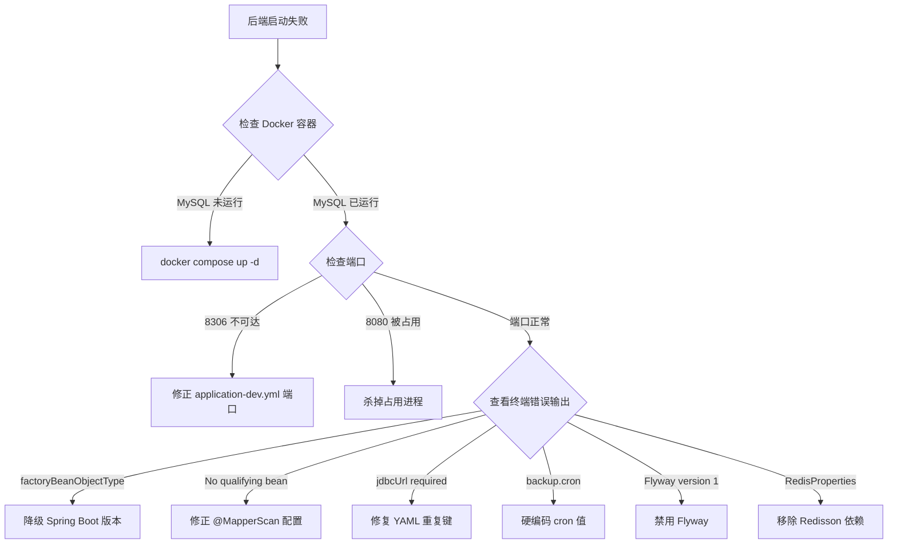

# 科研成果与知识产权管理系统 — 启动指南

> 编写日期：2026-06-23  
> 项目版本：v0.1.0-SNAPSHOT  
> 技术栈：Spring Boot 3.1.12 + Vue 3 + MySQL 8.4 + Redis 7

---

## 一、环境准备

### 1.1 安装清单

在开始之前，请确保以下工具已安装并可执行：

```bash
# 验证命令（全部通过才能继续）
java -version                # → JDK 21.0.x
node -v                      # → v18.x 或更高
npm -v                       # → 9.x 或更高
docker --version             # → Docker 29.x 或更高
docker compose version       # → Docker Compose v2.x 或更高
```

如果 `docker compose` 报错，尝试 `docker-compose --version`（旧版 Docker 用短横线版本）。

### 1.2 端口占用检查

以下端口必须空闲，或有冲突时提前处理：

| 端口 | 用途 | 检查命令 |
|------|------|---------|
| 8306 | MySQL | `netstat -ano | grep 8306` |
| 6379 | Redis | `netstat -ano | grep 6379` |
| 8080 | 后端 API | `netstat -ano | grep 8080` |
| 5173 | 前端 Vite | `netstat -ano | grep 5173` |

如果有进程占用了端口，要么杀掉它（`taskkill /PID <pid>`），要么修改对应配置。

---

## 二、完整启动流程

整个启动过程分为 **5 步**，约需 **10-20 分钟**。建议按顺序执行，每一步完成后验证再继续。

---

### Step 1：启动基础设施（Docker）

```bash
cd d:/RAIPMSystem

# 启动 MySQL 8.4 + Redis 7
docker compose up -d
```

**等待就绪（约 30 秒）**：

```bash
# 反复运行直到 MySQL 状态为 healthy
docker ps --format "table {{.Names}}\t{{.Status}}"

# 预期输出：
# achievement-mysql   Up X seconds (healthy)
# achievement-redis   Up X seconds (healthy)

# 检查数据库是否存在
docker exec achievement-mysql mysql -proot123 -e "SHOW DATABASES;" 2>/dev/null

# 预期输出应包含：
# achievement_db
# achievement_classified
# information_schema
# mysql
# performance_schema
# sys
```

**如果不能连接 MySQL**：

```bash
# 查看容器日志
docker logs achievement-mysql --tail 30
```

**如果 MySQL 无法启动（常见于 Windows 下端口冲突）**：

```bash
# 查看 3306 是否被本机 MySQL 服务占用
netstat -ano | grep 3306

# 如果 3306 被占用，修改 docker-compose.yml：
#   将 ports: "8306:3306" 改为其他端口如 "8307:3306"
#   并同步修改 application-dev.yml 中的端口
```

---

### Step 2：检查数据库状态

数据库容器启动后还需要检查**表结构是否完整**。如果这是首次启动，或数据库是全新创建的，表结构可能不存在。

```bash
# 查看已有表
docker exec achievement-mysql mysql -proot123 achievement_db \
  -e "SELECT COUNT(*) AS total_tables FROM information_schema.tables WHERE table_schema='achievement_db';"
```

**如果表数量 > 10**（说明数据库已有结构，可以跳过建表步骤）：

```
+--------------+
| total_tables |
+--------------+
|           18 |
+--------------+
```

✅ 直接进入 Step 3。

**如果表数量为 0 或数据库不存在**：

数据库初始化脚本位于 `db/init/01-init.sql`，Docker 首次启动时会自动执行。如果 Docker 容器已存在但数据库为空，需要手动初始化：

```bash
# 手动执行初始化脚本
docker exec -i achievement-mysql mysql -proot123 < db/init/01-init.sql

# 手动执行所有 Flyway 迁移（按版本顺序）
# 注意：以下脚本需要按版本号顺序执行
docker exec -i achievement-mysql mysql -proot123 achievement_db < achievement-module/achievement-system/src/main/resources/db/migration/V1__init_system_tables.sql
docker exec -i achievement-mysql mysql -proot123 achievement_db < achievement-module/achievement-system/src/main/resources/db/migration/V2__add_audit_log_file__tables.sql
docker exec -i achievement-mysql mysql -proot123 achievement_db < achievement-module/achievement-system/src/main/resources/db/migration/V3__add_api_config_table.sql
docker exec -i achievement-mysql mysql -proot123 achievement_db < achievement-module/achievement-paper/src/main/resources/db/migration/V1__create_paper_table.sql
docker exec -i achievement-mysql mysql -proot123 achievement_db < achievement-module/achievement-paper/src/main/resources/db/migration/V2__create_attachment_table.sql
docker exec -i achievement-mysql mysql -proot123 achievement_db < achievement-module/achievement-paper/src/main/resources/db/migration/V3__create_draft_support_index.sql
docker exec -i achievement-mysql mysql -proot123 achievement_db < achievement-module/achievement-paper/src/main/resources/db/migration/V4__create_doi_source_config_table.sql
docker exec -i achievement-mysql mysql -proot123 achievement_db < achievement-module/achievement-patent/src/main/resources/db/migration/V5__create_patent_table.sql
docker exec -i achievement-mysql mysql -proot123 achievement_db < achievement-module/achievement-copyright/src/main/resources/db/migration/V6__create_copyright_table.sql
docker exec -i achievement-mysql mysql -proot123 achievement_db < achievement-module/achievement-system/src/main/resources/db/migration/V7__create_approval_record_table.sql
docker exec -i achievement-mysql mysql -proot123 achievement_db < achievement-module/achievement-system/src/main/resources/db/migration/V8__create_notification_table.sql
docker exec -i achievement-mysql mysql -proot123 achievement_db < achievement-module/achievement-system/src/main/resources/db/migration/V9__create_import_record_table.sql
docker exec -i achievement-mysql mysql -proot123 achievement_db < achievement-module/achievement-system/src/main/resources/db/migration/V10__create_invalidation_record_table.sql
docker exec -i achievement-mysql mysql -proot123 achievement_db < achievement-module/achievement-fee/src/main/resources/db/migration/V11__create_fee_record_table.sql
docker exec -i achievement-mysql mysql -proot123 achievement_db < achievement-module/achievement-fee/src/main/resources/db/migration/V12__create_fee_plan_table.sql
docker exec -i achievement-mysql mysql -proot123 achievement_db < achievement-module/achievement-fee/src/main/resources/db/migration/V13__create_alert_record_table.sql
docker exec -i achievement-mysql mysql -proot123 achievement_db < achievement-module/achievement-fee/src/main/resources/db/migration/V15__add_fee_stats_index.sql
docker exec -i achievement-mysql mysql -proot123 achievement_db < achievement-module/achievement-system/src/main/resources/db/migration/V16__add_ngram_fulltext_indexes.sql

# 创建 classified 库的表（如果有）
docker exec -i achievement-mysql mysql -proot123 achievement_classified < achievement-module/achievement-system/src/main/resources/db/migration/V1__init_system_tables.sql
```

---

### Step 3：构建后端

```bash
cd d:/RAIPMSystem

# 首次构建（会下载所有依赖，耗时 5-15 分钟）
./mvnw clean install -Dmaven.test.skip=true
```

**期望输出**：

```
[INFO] BUILD SUCCESS
[INFO] Total time:  XX.XXX s
```

**如果构建失败**：

**问题 1：`Failed to clean project: Failed to delete ...\target\classes`**

原因：Windows 文件锁（Java 进程或文件浏览器打开了 target 目录）。

```bash
# 杀掉所有 Java 进程释放锁
pkill -f java
# Windows 下如果 pkill 不可用：
#   打开任务管理器，结束所有 java.exe 进程

# 删除本机仓库缓存
rm -rf ~/.m2/repository/com/institute

# 重试
./mvnw clean install -Dmaven.test.skip=true
```

**问题 2：`Child module ... does not exist`**

原因：目标目录被误删。

```bash
git checkout -- achievement-module
./mvnw clean install -Dmaven.test.skip=true
```

**问题 3：其他编译错误**

如果出现之前没遇到过的编译错误，查看报错的模块和文件：

```bash
# 从失败模块继续构建
./mvnw clean install -Dmaven.test.skip=true -pl achievement-module/achievement-fee -am
```

---

### Step 4：启动后端

```bash
cd d:/RAIPMSystem

# 使用 spring-boot:run 启动（推荐方式）
./mvnw spring-boot:run \
  -pl achievement-module/achievement-system \
  -Dspring-boot.run.profiles=dev \
  -Dmaven.test.skip=true \
  -am
```

**也可以直接用可执行 JAR 启动**（如果 step 3 的 `install` 已完成）：

```bash
java -jar achievement-module/achievement-system/target/achievement-system-0.1.0-SNAPSHOT-executable.jar \
  --spring.profiles.active=dev
```

**等待出现以下输出**（约 10-20 秒）：

```
2026-06-23T06:16:40.288+08:00  INFO 27704 --- [           main] c.i.a.m.s.AchievementSystemApplication   : Started AchievementSystemApplication in 9.432 seconds (process running for 10.032)
```

**验证后端**：

```bash
# 新开一个终端窗口

# 检查端口（应该看到 LISTENING）
netstat -ano | grep 8080

# HTTP 健康检查（返回 401 说明运行正常——Spring Security 保护）
curl -v http://localhost:8080/actuator/health 2>&1 | grep "< HTTP"
# 预期输出：HTTP/1.1 401

# 如果返回 200 或 000：
#   200 = 正常（如果 Security 配置允许）
#   000 = 后端未启动，检查上方终端窗口的输出
```

**如果后端启动失败**：

```bash
# 查看完整错误输出
# 常见错误及对策见下表
```

| 错误信息 | 原因 | 解决方案 |
|---------|------|---------|
| `CommunicationsException: Connection refused` | MySQL 未启动或端口错误 | `docker compose up -d`，检查端口配置 |
| `jdbcUrl is required with driverClassName` | YAML datasource 配置被覆盖 | 检查 `application-dev.yml` 是否有重复的 `datasource:` 键 |
| `factoryBeanObjectType: java.lang.String` | MyBatis-Plus 与 Spring Boot 版本不兼容 | 确认 `pom.xml` 中 Spring Boot 版本为 3.1.12 |
| `No qualifying bean of type '...SysUserMapper'` | `@MapperScan` 包名列表不完整 | 确认 `MyBatisPlusConfig.java` 中所有 mapper 包都已列出 |
| `No qualifying bean of type '...ApiConfigMapper'` | 非 `.mapper` 包中的 Mapper 未被注册 | 确认 `MyBatisPlusConfig.java` 中有对应的 `MapperFactoryBean` bean |
| `Found more than one migration with version 1` | Flyway 多模块版本冲突 | `application-dev.yml` 中 `flyway.enabled: false` |
| `Could not resolve placeholder 'backup.cron'` | `@Scheduled` 占位符无法解析 | `BackupSchedulerService.java` 中硬编码 cron 值 |
| `Port 8080 already in use` | 端口被占用 | `netstat -ano \| grep 8080` 找到 PID 并杀掉 |
| 启动后立即退出（无错误） | 配置加载失败、Profile 未生效 | 确认命令行传入了 `--spring.profiles.active=dev` |

---

### Step 5：启动前端

**新开一个终端窗口**：

```bash
cd d:/RAIPMSystem/achievement-web

# 如果 node_modules 不存在
ls node_modules/.package-lock.json 2>/dev/null || npm install

# 启动开发服务器
npm run dev
```

**期望输出（约 2-5 秒）**：

```
  VITE v5.4.21  ready in 1708 ms

  ➜  Local:   http://localhost:5173/
```

**验证前端**：

```bash
# 新开终端
curl -s -o /dev/null -w "%{http_code}" http://localhost:5173
# 预期输出：200
```

**如果前端启动失败**：

| 错误 | 原因 | 解决方案 |
|------|------|---------|
| `npm ERR!` | 网络问题或依赖缺失 | `npm install` 重试，或 `npm cache clean --force` |
| `Error: listen EACCES` | 端口 5173 被占用 | `netstat -ano \| grep 5173`，杀掉占用进程 |
| 控制台报 API 401 | 前端需要登录 | 这是预期的，通过登录页面获取 token |

---

## 三、启动后的验证

两个终端窗口都正常运行后，执行以下验证：

```bash
echo "=== 1. Docker 容器 ==="
docker ps --format "table {{.Names}}\t{{.Status}}" | grep achievement

echo ""
echo "=== 2. 后端 API ==="
curl -s -o /dev/null -w "Health endpoint: HTTP %{http_code}\n" http://localhost:8080/actuator/health

echo ""
echo "=== 3. 前端 SPA ==="
curl -s -o /dev/null -w "Frontend: HTTP %{http_code}\n" http://localhost:5173

echo ""
echo "=== 4. Swagger 文档 ==="
curl -s -o /dev/null -w "Swagger UI: HTTP %{http_code}\n" http://localhost:8080/swagger-ui/index.html

echo ""
echo "=== 5. 数据库表 ==="
docker exec achievement-mysql mysql -proot123 achievement_db \
  -e "SELECT COUNT(*) AS tables FROM information_schema.tables WHERE table_schema='achievement_db';"

echo ""
echo "=== 6. OpenAPI Schema ==="
curl -s http://localhost:8080/v3/api-docs | head -c 100
echo "..."

echo ""
echo "=========================================="
echo "  验证完成"
echo "=========================================="
```

---

## 四、访问入口

| 组件 | 地址 | 说明 |
|------|------|------|
| 前端页面 | http://localhost:5173 | Vue 3 + Element Plus SPA |
| Swagger UI | http://localhost:8080/swagger-ui/index.html | 在线 API 文档（需登录） |
| OpenAPI JSON | http://localhost:8080/v3/api-docs | API 规范 JSON |
| 后端健康检查 | http://localhost:8080/actuator/health | 返回 401 即正常（已认证） |

---

## 五、关闭服务

### 5.1 一键关闭（推荐）

```bash
cd d:/RAIPMSystem

# 1. 停止 Docker 容器（保留数据卷，下次直接 docker compose start 即可恢复）
docker compose stop

# 2. 杀掉 Spring Boot 后端进程
pkill -f "spring-boot:run" 2>/dev/null || pkill -f "achievement-system" 2>/dev/null

# 3. 杀掉 Vite 前端进程
pkill -f "vite" 2>/dev/null

echo "所有服务已关闭"
```

### 5.2 逐个关闭

| 组件 | 关闭方式 |
|------|---------|
| **前端** | 在运行 `npm run dev` 的终端按 `Ctrl + C` |
| **后端** | 在运行 `mvnw spring-boot:run` 的终端按 `Ctrl + C`（没反应多按几次） |
| **Docker 容器** | `docker compose stop`（保留数据）或 `docker compose down`（保留数据卷） |

### 5.3 Docker 停止方式的区别

```bash
# ① 暂停容器（保留一切，下次 docker compose start 秒启）
docker compose stop

# ② 停止并移除容器网络（保留数据卷，下次 docker compose up -d 恢复）
docker compose down

# ③ ⚠️ 彻底清除（删除所有数据卷，下次要重新初始化数据库）
docker compose down -v
```

> **建议**：日常开发用 `docker compose stop` 即可。数据卷（MySQL 和 Redis 的数据文件）会保存在 Docker 的 volumes 中，下次 `docker compose start` 或 `docker compose up -d` 后数据完整恢复。

### 5.4 验证是否已关闭

```bash
# 检查端口是否释放（应该看不到 8080/5173 的 LISTENING）
netstat -ano | grep -E "8080|5173"

# 检查 Java/Node 进程是否还在
ps aux | grep -E "java|node|vite" 2>/dev/null || tasklist | findstr /i "java node" 2>nul

# 检查 Docker 容器状态
docker ps --format "table {{.Names}}\t{{.Status}}"
# 如果显示 Exited 或没显示，说明已关闭
```

### 5.5 重新启动

关闭后重新启动，不需要重新构建：

```bash
# Docker 容器重新启动（如果用的是 docker compose stop）
docker compose start

# 或如果用的是 docker compose down
docker compose up -d

# 后端（不需要重新 install，直接 run 即可）
./mvnw spring-boot:run -pl achievement-module/achievement-system \
  -Dspring-boot.run.profiles=dev -Dmaven.test.skip=true -am

# 前端
cd achievement-web && npm run dev
```

---

## 六、常见故障快速排查表

### 6.1 后端无法启动



### 6.2 后端能启动但接口返回 401

这是预期的——所有 API 都受 Spring Security 保护。前端登录后会获取 JWT Token，后续请求通过 Bearer Token 认证。如果需要测试 API：

```bash
# 先通过登录接口获取 token（需要管理员账号）
curl -s -X POST http://localhost:8080/api/auth/login \
  -H "Content-Type: application/json" \
  -d '{"username":"admin","password":"admin123"}' \
  | python -m json.tool
```

### 6.3 Maven 构建太慢

```bash
# 使用国内镜像加速
# 创建或编辑 ~/.m2/settings.xml：
cat > ~/.m2/settings.xml << EOF
<settings>
  <mirrors>
    <mirror>
      <id>aliyun</id>
      <mirrorOf>central</mirrorOf>
      <name>阿里云公共仓库</name>
      <url>https://maven.aliyun.com/repository/public</url>
    </mirror>
  </mirrors>
</settings>
EOF
```

### 6.4 npm install 太慢

```bash
npm config set registry https://registry.npmmirror.com
npm install
```

### 6.5 如果一切失败：回退到干净状态

```bash
# 查看修改了哪些文件
cd d:/RAIPMSystem
git diff --name-only

# 丢弃所有修改（回到原始提交状态）
git checkout -- .

# 查看 stash 中是否有备份
git stash list

# 如果要恢复我之前的修复修改
git stash pop stash@{0}
```

---

## 七、修改文件清单（与 git 原始代码的差异）

以下是在原始 git HEAD 基础上所做的所有修改，用于参考和回溯：

```
M pom.xml                                           # Spring Boot 降级 4.1.0 → 3.1.12
                                                    # springdoc 降级 3.0.2 → 2.1.0
                                                    # 移除 flyway.version 属性
M achievement-framework/pom.xml                     # 移除 Redisson 依赖
M achievement-framework/src/main/resources/application.yml
                                                    # 修复 YAML 重复 spring: 键（task 合入）
M achievement-framework/src/main/resources/application-dev.yml
                                                    # MySQL 3306→8306
                                                    # 修复重复 datasource: 键
                                                    # 禁用 Flyway
                                                    # 添加 hikari.jdbc-url
M achievement-framework/src/main/java/.../config/MyBatisPlusConfig.java
                                                    # 列显所有 mapper 包名
                                                    # 添加 MapperFactoryBean 手动注册
M achievement-framework/src/main/java/.../backup/BackupSchedulerService.java
                                                    # 硬编码 cron
M achievement-module/achievement-fee/pom.xml         # 添加 achievement-system 依赖
M achievement-module/achievement-fee/src/main/java/.../dto/FeeStatsExcelVO.java
                                                    # 移除 @ColumnWidth
M achievement-module/achievement-fee/src/main/java/.../controller/FeeRecordController.java
                                                    # batchPay 去除 slipNo 参数
M achievement-module/achievement-fee/src/main/java/.../service/impl/FeeRecordServiceImpl.java
                                                    # currentUserId→SecurityUtils.getCurrentUserId()
M achievement-module/achievement-system/pom.xml      # 添加 classifier=executable
```

---

## 八、关键技术决策记录

### 8.1 为什么不用 Spring Boot 4.x？

因为 MyBatis-Plus 3.5.7 与其不兼容。具体来说，Spring Framework 7.x（Spring Boot 4.x 的底层框架）的 `FactoryBeanRegistrySupport.getTypeForFactoryBeanFromAttributes()` 方法只接受 `Class<?>` 类型的 `factoryBeanObjectType` 属性，但 MyBatis-Plus 3.5.7 将该属性设置为 `String` 类型（Mapper 类名字符串）。

MyBatis-Plus 3.5.10+ 修复了这个问题，但同时又移除了 JSQLParser 依赖和 `PaginationInnerInterceptor` 类，与项目代码中的分页逻辑不兼容。

### 8.2 为什么 Flyway 被禁用？

因为多个模块各自有独立的 `V1__*.sql` 文件，但 Flyway 要求版本号全局唯一。数据库已通过之前的运行创建了所有表结构（见 `flyway_schema_history` 表），因此不需要重复迁移。

如果需要重新启用 Flyway，需要重新编排所有迁移脚本的版本号以消除冲突（例如 system=V1-V10, paper=V11-V20, patent=V21-V30...）。

### 8.3 为什么 Redisson 被移除？

因为 Redisson 3.30.0 引用了 Spring Boot 4.x 中已移除/重命名的 `RedisProperties` 类。且项目中没有任何代码直接使用 Redisson——所有 Redis 操作都通过 `spring-boot-starter-data-redis` 的 `StringRedisTemplate` 完成。

### 8.4 为什么 Mapper 需要手动注册？

因为 `ApiConfigMapper`、`AuditLogMapper`、`FileRecordMapper` 这三个 Mapper 位于非标准包（`.api`、`.audit`、`.file`）中。如果直接用 `@MapperScan` 扫描这些包，会将其中的非 Mapper 接口（如 `ApiConfigService`、`AuditLogService`、`FileStorageService`）也注册为 MyBatis Mapper，导致 bean 冲突。

---

## 九、一键启动脚本

```bash
@echo off
REM 一键启动脚本 (Windows Batch)
REM 保存为 start.bat，放在 d:/RAIPMSystem 目录下运行

echo [1/5] Starting Docker services...
docker compose up -d
if %ERRORLEVEL% NEQ 0 ( echo FAILED: Docker compose && pause && exit /b 1 )

echo Waiting for MySQL...
timeout /t 10 /nobreak >nul

echo [2/5] Checking database...
docker exec achievement-mysql mysql -proot123 achievement_db -e "SELECT 1;" >nul 2>&1
if %ERRORLEVEL% NEQ 0 ( echo FAILED: MySQL not ready && pause && exit /b 1 )
echo OK

echo [3/5] Building backend...
call ./mvnw clean install -Dmaven.test.skip=true -q
if %ERRORLEVEL% NEQ 0 ( echo FAILED: Maven build && pause && exit /b 1 )
echo OK

echo [4/5] Starting backend...
start "Backend" cmd /c ".\mvnw spring-boot:run -pl achievement-module/achievement-system -Dspring-boot.run.profiles=dev -Dmaven.test.skip=true -am"

echo Waiting for backend... (60 seconds)
timeout /t 60 /nobreak >nul

echo [5/5] Starting frontend...
cd achievement-web
start "Frontend" cmd /c "npm run dev"
cd ..

echo.
echo ==========================================
echo  ALL SERVICES STARTED
echo  Backend:  http://localhost:8080
echo  Frontend: http://localhost:5173
echo  API Docs: http://localhost:8080/swagger-ui/index.html
echo ==========================================
pause
```
